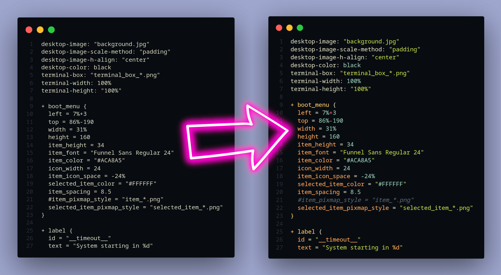

# GRUB Theme Syntax Highlighter

Developing or customizing a GRUB theme involves editing the `theme.txt` file. Due to the file being plaintext, there is no syntax highlighting. GRUB Theme Syntax Highlighter solves that issue.

## Preview
### Mayukai Dark
